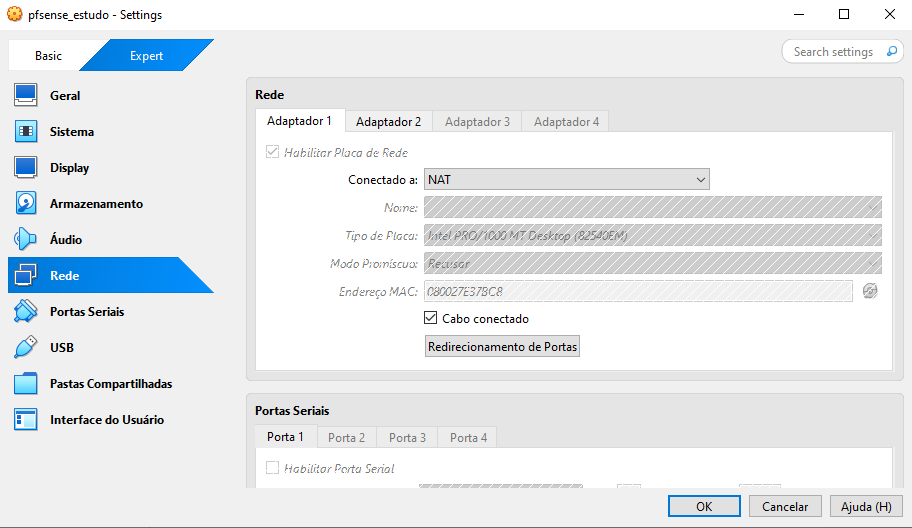
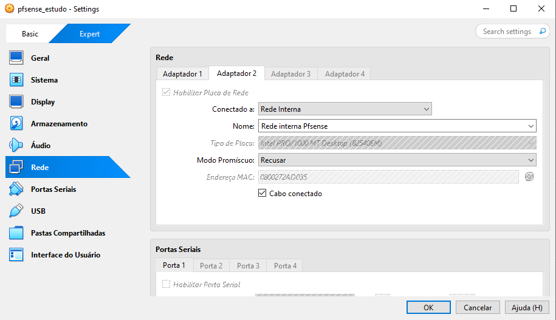
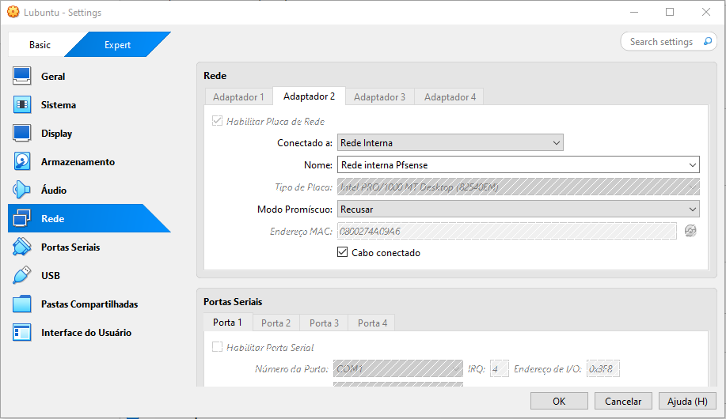
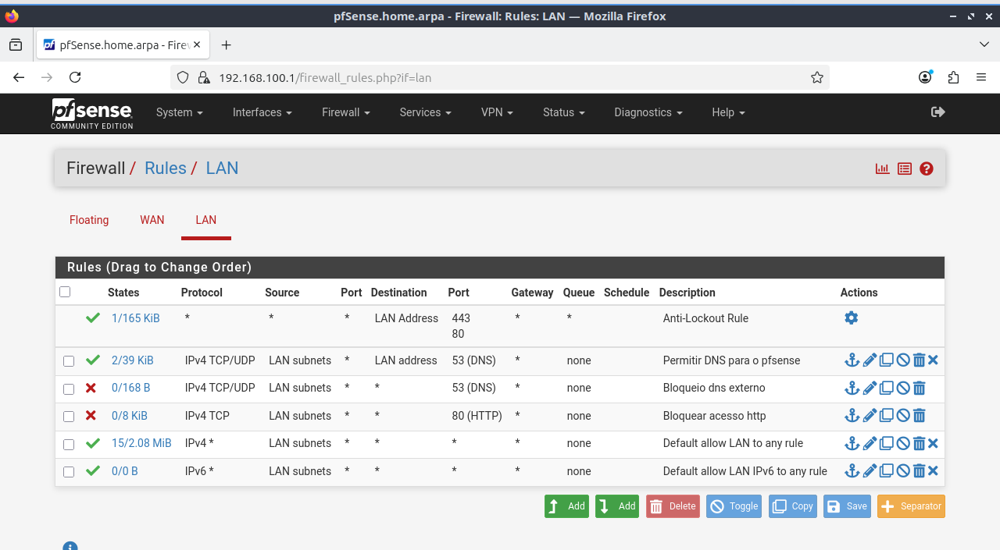
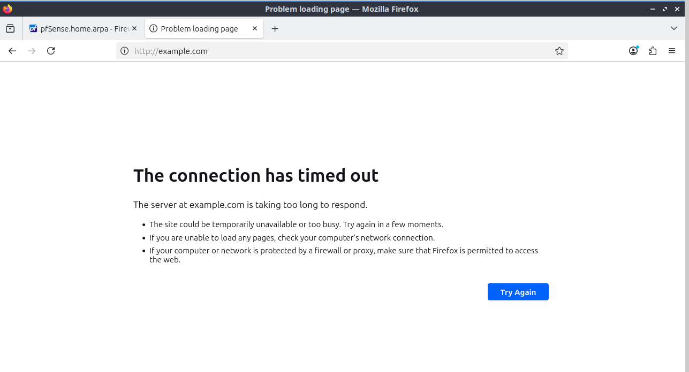
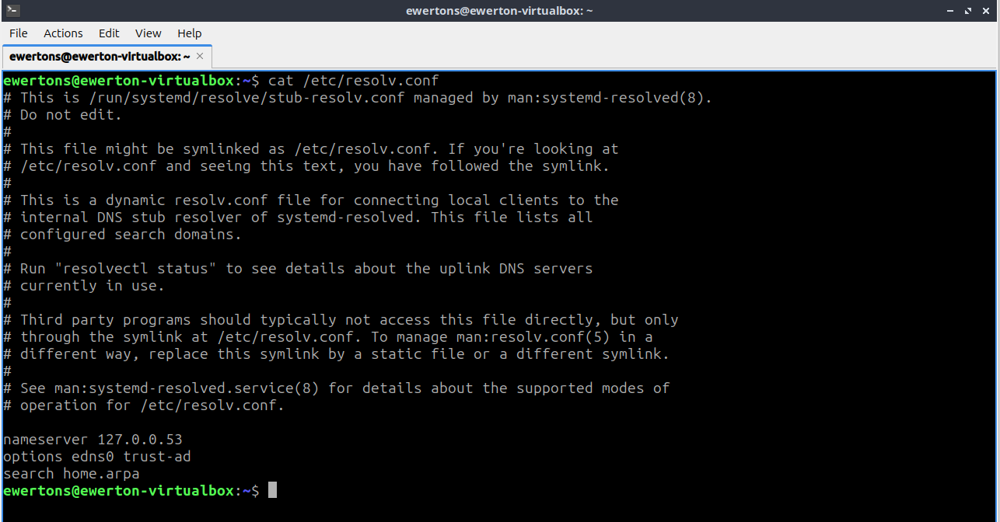
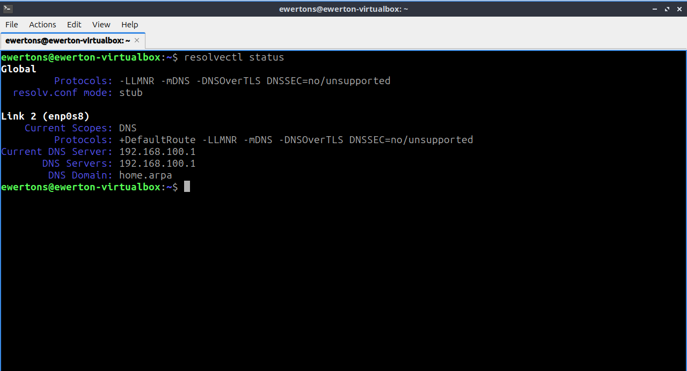
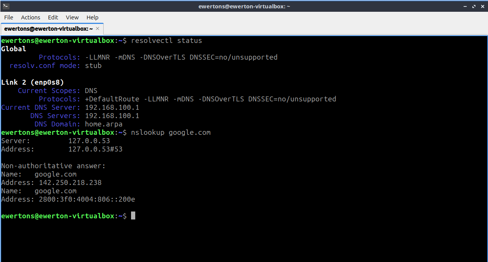
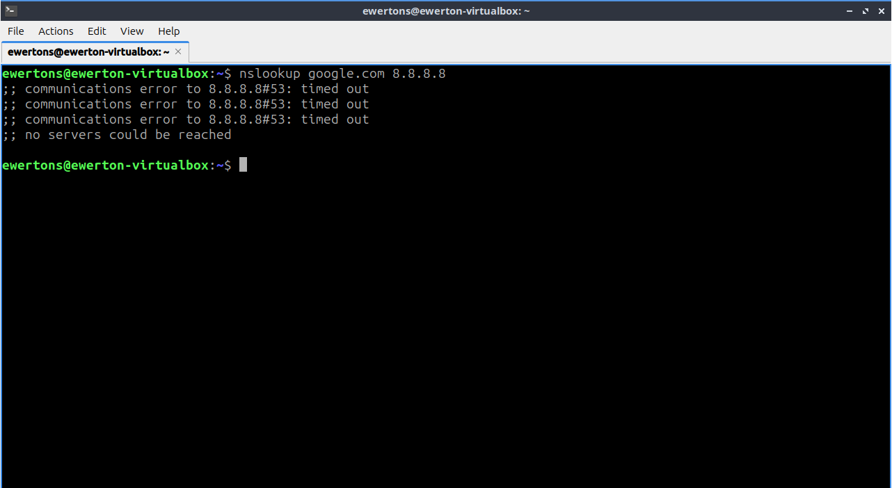

Laboratório Virtual - Virtualbox + pfSense + Lubuntu

Autor: Ewerton Cardoso de SouzaData: 30/07/2025

Objetivo: Simular ambiente de rede com gateway/firewall (pfSense)

Controlar acesso à internet e DNS das máquinas cliente (Lubuntu)

Implementar testes de bloqueio por porta e IP

Preparar base para futuros testes com serviços internos (DHCP, Web, DNS local, etc.)

---------------------------------------------------------------------------------
[ pfSense VM ]

Adaptador 1 (WAN):

Tipo: NAT

Objetivo: Acesso externo à internet via NAT do VirtualBox

Adaptador 2 (LAN):

Tipo: Rede Interna (Internal Network)

Nome da rede: "Rede interna pfsense"

Objetivo: Rede local para comunicação com outras VMs

---------------------------------------------------------------------------------
[ Lubuntu VM ]

Adaptador 1:

Tipo: NAT (utilizado apenas para atualizações, se necessário)

Adaptador 2:

Tipo: Rede Interna

Nome da rede: "Rede interna pfsense"

Objetivo: Receber IP via DHCP do pfSense e acessar a internet através dele

Interface WAN:

IP dinâmico via DHCP (NAT do VirtualBox)

Interface LAN:

IP estático: 192.168.100.1/24

DHCP Server: ativado

Range: 192.168.100.10 a 192.168.100.100

DNS Resolver ou Forwarder: Ativado (opcional)

NAT:

Ativado automaticamente via interface WAN

Interface de rede (rede interna):

Obtém IP via DHCP do pfSense

Gateway padrão: 192.168.100.1

DNS: 192.168.100.1 (configurado pelo pfSense via DHCP)

---------------------------------------------------------------------------------
Testes de conectividade:

ping 8.8.8.8 → Testa acesso à internet

nslookup google.com 8.8.8.8 → Testa funcionamento de DNS externo

nslookup google.com → Testa se a máquina está usando o DNS interno (pfSense)

---------------------------------------------------------------------------------
Regra de firewall criada para bloquear HTTP (porta 80):

Action: Block

Protocol: TCP/UDP

Source: LAN subnet

Destination: any

Destination Port: 80

Observação: Impede qualquer acesso da rede interna a sites que utilizam HTTP sem criptografia

---------------------------------------------------------------------------------
Sites utilizados para teste de HTTP puro (sem redirecionamento para HTTPS):

1 - http://example.com2 - http://neverssl.com3 - http://httpforever.com4 - http://info.cern.ch5 - http://http.badssl.com/

Os acessos inicialmente não foram bloqueados. Após análise, identificou-se que o Lubuntu estava com duas interfaces ativas:

Uma em modo NAT (acessando a internet diretamente)

Outra conectada à LAN do pfSense

O tráfego estava saindo pela interface NAT, bypassando o firewall. Após desativar a interface NAT, o tráfego passou exclusivamente pelo pfSense, e os bloqueios passaram a funcionar corretamente.

---------------------------------------------------------------------------------
Regra de firewall criada para bloquear consultas DNS externas:

Action: Block

Protocol: TCP/UDP

Source: LAN subnet

Destination: any

Destination Port: 53

Observação: Impede que clientes da LAN consultem servidores DNS externos diretamente

OBS: Mesma imagem da regra de firewall anterior.

---------------------------------------------------------------------------------
8.1 – Verificação do DNS em uso

**Comandos utilizados:**

1. cat /etc/resolv.conf

2. systemd-resolve --status

3. nmcli device show

**Resultado comum:**

nameserver 127.0.0.1

Esse é um resolvedor local. Para descobrir o DNS real, foi usado:

resolvectl status

Resposta esperada:

Link 2 (enp0s3)
    Current Scopes: DNS
         DNS Servers: 192.168.100.1

         
---------------------------------------------------------------------------------
8.2 – Teste de funcionamento do DNS interno

nslookup google.com

**Resultado:**

Server: 192.168.100.1
Address: 192.168.100.1#53

Non-authoritative answer:
Name:   google.com
Address: 142.250.78.206

---------------------------------------------------------------------------------
8.3 – Teste de bloqueio ao DNS externo

nslookup google.com 8.8.8.8

**Resultado:**

;; connection timed out; no servers could be reached

Confirma que o firewall bloqueou com sucesso o acesso à porta 53 de servidores externos.

---------------------------------------------------------------------------------
